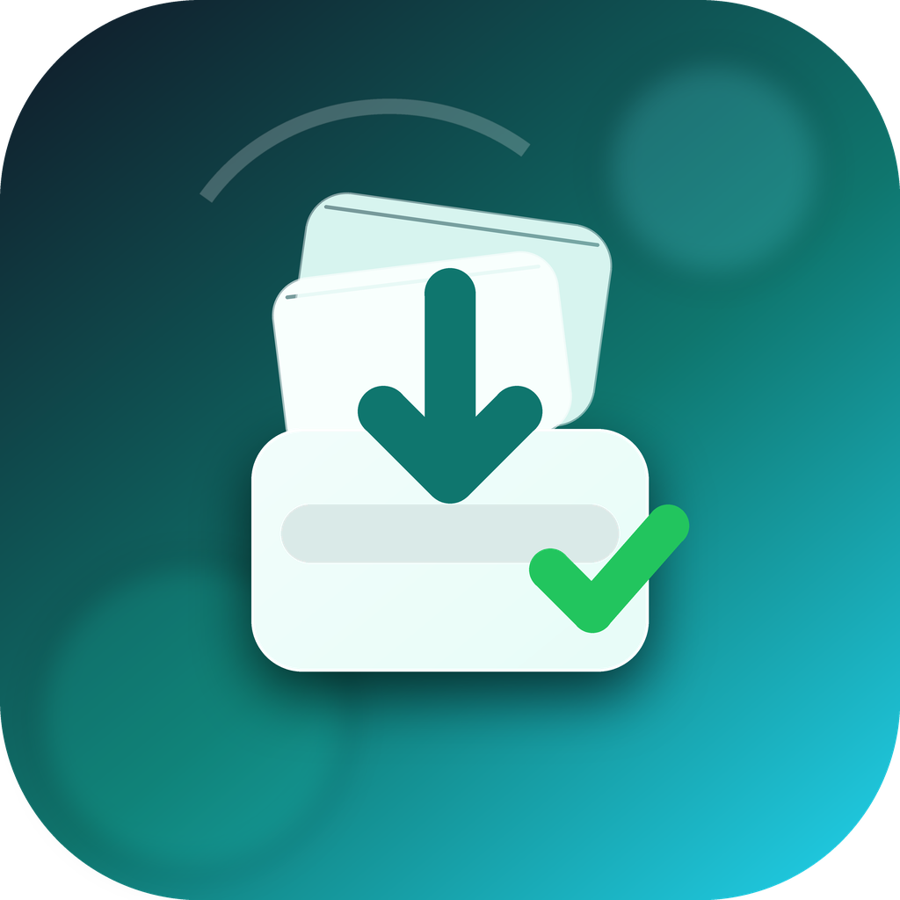

# DropClean

  

**DropClean keeps your Mac Downloads folder clean automatically.**

DropClean is a lightweight macOS utility that watches your Downloads folder and organizes new files by type. PDFs, images, videos, archives, installers, and office documents can be moved into clear destination folders, so your Downloads folder does not become a dumping ground.

[Download DropClean for macOS](https://github.com/chenzicheng198505-coder/DropClean/releases/latest)

## Why DropClean

- Automatically organizes files from `~/Downloads`
- One-click cleanup for existing downloaded files
- Clear rules for PDFs, images, videos, archives, installers, and office files
- Shows exactly where files were moved after cleanup
- Keeps a local move history
- Supports English and Simplified Chinese

## Download

Current version: **1.0.0**

- Apple Silicon Mac: [DropClean-1.0.0-arm64.dmg](https://github.com/chenzicheng198505-coder/DropClean/releases/download/v1.0.0/DropClean-1.0.0-arm64.dmg)
- ZIP package: [DropClean-1.0.0-arm64-mac.zip](https://github.com/chenzicheng198505-coder/DropClean/releases/download/v1.0.0/DropClean-1.0.0-arm64-mac.zip)

## How It Works

1. Download and install DropClean.
2. Open the app.
3. Click **Start Clean** to organize existing files in `~/Downloads`.
4. Keep monitoring enabled to organize new downloaded files automatically.
5. After cleanup, DropClean shows the destination folder for each file category.

## Default Rules

| File type | Destination |
| --- | --- |
| PDF | `~/Documents/PDF` |
| Images | `~/Pictures/Downloads` |
| Videos | `~/Movies/Downloads` |
| Archives | `~/Archives` |
| Installers | `~/Installers` |
| Office documents | `~/Documents/Office` |

## Notes

- DropClean currently provides an Apple Silicon build for macOS.
- The app runs locally. It does not require an account or cloud sync.
- This public repository is used for product introduction and downloads. Source code is not included.

---

# DropClean 中文介绍

**DropClean 是一个自动整理 Mac 下载文件夹的小工具。**

它会监听 `~/Downloads`，根据文件类型把 PDF、图片、视频、压缩包、安装包、Office 文档自动移动到对应目录。整理完成后，界面会显示每类文件去了哪里，避免用户不知道文件被移动到哪个文件夹。

[下载 DropClean for macOS](https://github.com/chenzicheng198505-coder/DropClean/releases/latest)

## 适合谁

- 下载文件夹长期很乱的 Mac 用户
- 经常下载 PDF、图片、安装包、压缩包的人
- 不想手动分类整理文件的人
- 希望下载后文件自动归位的人

## 核心功能

- 自动监听 Mac 下载文件夹
- 一键整理已有下载文件
- 按文件类型自动分类
- 显示整理完成状态和文件去向
- 保留本地整理历史
- 支持英文和简体中文

## 默认整理规则

| 文件类型 | 目标目录 |
| --- | --- |
| PDF | `~/Documents/PDF` |
| 图片 | `~/Pictures/Downloads` |
| 视频 | `~/Movies/Downloads` |
| 压缩包 | `~/Archives` |
| 安装包 | `~/Installers` |
| Office 文档 | `~/Documents/Office` |

## 使用方法

1. 下载 DMG 安装包。
2. 安装并打开 DropClean。
3. 点击 **Start Clean** 整理已有下载文件。
4. 保持监控开关开启，后续新下载文件会自动整理。
5. 整理完成后，在首页查看每类文件的去向。

## 说明

- 当前版本优先支持 Apple Silicon Mac。
- 应用本地运行，不需要账号，不依赖云同步。
- 该 GitHub 仓库用于产品介绍和下载，不包含源码。
